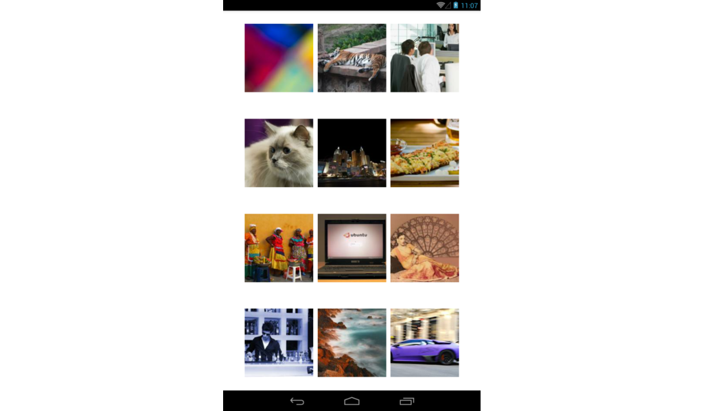

# Lab 102 - Layout

React Native 使用類似 CSS 的方式定義畫面的 Layout。

難易度：★

資料夾：`lab/102`

## 學習目標

* 使用 `Image` UI Component

## 題目說明

* 新建 React Native 專案命名為「`MyApp`」。
* 在畫面上顯示圖片：`http://lorempixel.com/320/320/sports/1`
* 在畫面上顯示 12 張照片（排列為 3 x 4）。

參考資料：`lorempixel.com` 的圖片分類：

```
abstract    animals     business    cats        city
food        nightlife   fashion     people      nature
sports      technics    transport
```

## 測試說明

* 請檢視 Android 模擬器畫面，確認程式是否正確執行。

## 參考畫面

