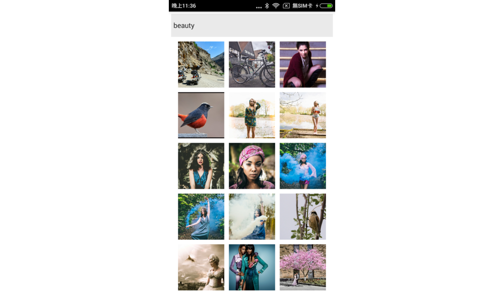

# Lab 103 - Finder

實作一個 Flickr 照片搜尋器。

難易度：★★

資料夾：`lab/103`

## 學習目標

* 透過網路存取遠端 API Server 提供的 JSON 資料。
* 輸入方塊（TextBox）與事件處理（Event Handling）。
* 操作 ListView 元件與 DataSource。

## 題目說明

* 新建 React Native 專案命名為「`MyApp`」。
* 使用 `TextInput` 實作搜尋輸入框。
* 使用 `fetch` 存取 Flickr API，使用 JSON Response 取得查詢結果。

   [flickr.photos.search](https://www.flickr.com/services/api/flickr.photos.search.html)

* 使用 `ListView` 清單顯示搜尋結果（照片＋標題文字）。

## 參考資料

Flickr Search API

```
https://api.flickr.com/services/rest/?&method=flickr.photos.search&format=json&nojsoncallback=1&per_page=10&api_key=b49d87bfd659c5768ab0eafa74f2b6a5&tags=
```

Flickr Picture URL Format

```
https://farm{farm-id}.staticflickr.com/{server-id}/{id}_{secret}.jpg
```

https://www.flickr.com/services/api/misc.urls.html

## 測試

* 請檢視 Android 模擬器畫面，確認程式是否正確執行。

## 參考畫面

